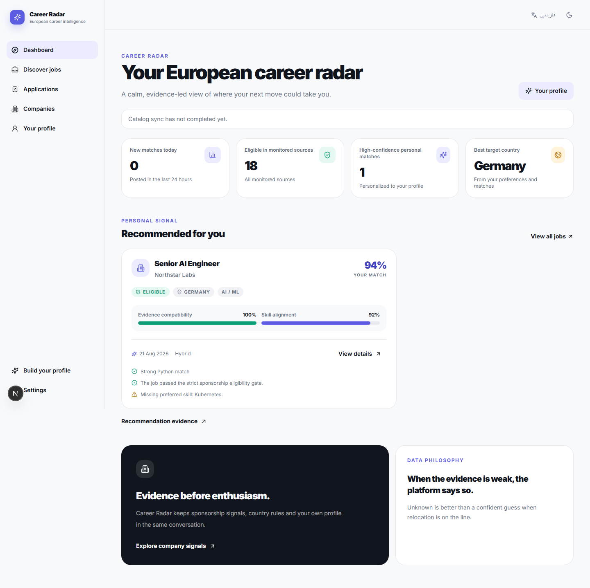

# Career Radar — Europe Visa Sponsorship Jobs

Career Radar is evidence-based European tech-job intelligence for non-EU candidates
who need visa sponsorship or relocation support. It is designed to answer a narrower,
more useful question than a generic job board: **which current European technical roles
have evidence worth a candidate's time?**

It uses deterministic rules and stored evidence—no LLM or paid AI API is required at
runtime.



## What makes it different

- European technical-market scope is enforced in catalog publication and import.
- Public employer ATS sources provide the underlying vacancy and application URLs.
- Sponsorship and relocation language is evaluated alongside explicit hard restrictions.
- A sponsor-register entry alone never makes every vacancy eligible.
- Missing or ambiguous evidence remains `unknown`; hard restrictions win.
- Candidate matching, saved jobs, notes, and application status stay local when the
  global market catalog refreshes.
- The product is available in English and Persian with server-rendered RTL support.

Career Radar deliberately prefers false negatives over false-positive sponsorship
claims. It is not immigration advice, and it cannot guarantee that an employer will
sponsor a particular candidate.

## Eligibility at a glance

| Status | Meaning | Default experience |
|---|---|---|
| `eligible` | Strong job-level sponsorship or relocation evidence, with no overriding restriction | Shown |
| `unknown` | Evidence is incomplete, ambiguous, or only company-level | Hidden unless explicitly included |
| `rejected` | A hard restriction was found, such as no sponsorship or existing work authorization | Hidden |

Evidence is retained with the job so candidates can inspect the reason for a result.
Upstream employer content can change after collection; source freshness and provenance
are surfaced rather than hidden.

## Install on Windows

The current downloadable release is [v1.2.1](https://github.com/MahdiNavaei/Europe-Visa-Sponsorship-Jobs/releases/tag/v1.2.1).
Download the setup executable or portable ZIP from
[Releases](https://github.com/MahdiNavaei/Europe-Visa-Sponsorship-Jobs/releases),
verify the published SHA-256 checksum, then install and launch—Python, Node.js, Docker,
and PostgreSQL are not required on the user's machine.

The release uses a local SQLite database and synchronizes a hash-verified, versioned
market catalog. Releases may be signed or unsigned depending on the configured release
mode; see [Windows packaging](docs/WINDOWS.md) and the
[code-signing policy](CODE_SIGNING_POLICY.md).

## Live data and coverage

Scheduled workflows revisit known public ATS boards and publish a versioned catalog
to the `market-data` branch. Verified boards become due after 18 hours; an hourly,
fair bounded scheduler gives the current registry an approximately 25-hour worst-case
revisit window while reserving capacity for newly verified boards. The workflow
refuses to claim that bound if registry growth exceeds its configured capacity. The
catalog is compressed, SHA-256 verified, gzip/schema validated, staged, and atomically
imported by clients. A failed update preserves the previous valid local catalog.

Coverage describes monitored, verified sources—not every European employer or vacancy.
A refreshed catalog does not guarantee a new eligible vacancy every day. Read the
[data-delivery contract](docs/data-delivery.md),
[source discovery guide](docs/SOURCE_DISCOVERY.md), and
[data licensing boundaries](DATA_LICENSES.md) before redistributing data.

## Architecture

```text
Public employer ATS sources
          ↓
Normalization + technical-role classification
          ↓
Sponsorship / relocation evidence + hard restrictions
          ↓
Country rules + sponsor-register evidence
          ↓
Versioned European market catalog ──→ local desktop import
          ↓                                  ↓
FastAPI API ← deterministic matching ← candidate-local state
          ↓
Next.js web app (English / Persian RTL)
```

The backend supports PostgreSQL and SQLite. The desktop runtime packages a private
backend, production Next.js server, migrations, and configuration. See
[architecture](docs/ARCHITECTURE.md), [product rules](docs/PRODUCT.md), and
[privacy](PRIVACY.md).

## Developer quick start

### Backend

```bash
python -m venv .venv
source .venv/bin/activate  # Windows: .venv\Scripts\activate
pip install -e ".[dev]"
alembic upgrade head
uvicorn europe_visa_jobs.api.app:app --reload
```

The API is available at `http://localhost:8000`; OpenAPI is at
`http://localhost:8000/docs`.

### Web app

```bash
cd apps/web
npm ci
npm run dev
```

Open `http://localhost:3000/en` or `http://localhost:3000/fa`.

For a production-style local stack, set a strong `POSTGRES_PASSWORD` and run:

```bash
docker compose -f docker-compose.production.yml up -d --build
```

## Validation and reliability

The repository validates Python 3.11/3.12, migrations, backend tests and coverage,
dependency audits, frontend lint/unit/build checks, browser flows, public-source health,
real catalog import, and a Windows silent-install/runtime smoke test. The Windows test
also exercises two market-data updates through the same installed runtime.

```bash
pytest --cov=europe_visa_jobs --cov-report=term-missing --cov-fail-under=85
ruff check src tests scripts
mypy src scripts --ignore-missing-imports

cd apps/web
npm ci
npm run lint
npm test
npm run build
```

## Limitations

- Employer policy, job text, and immigration rules can change.
- A role can be technically eligible for the catalog while still being unsuitable for
  an individual candidate.
- Unknown does not mean ineligible; it means the product lacks enough evidence to make
  a positive claim.
- Career Radar is not legal or immigration advice.

## License and commercial use

This repository is **source-available**, not OSI open source. Current distributions are
licensed under [PolyForm Noncommercial 1.0.0](LICENSE)
(`PolyForm-Noncommercial-1.0.0`): noncommercial use, modification, and redistribution
are permitted subject to the license and required notices. Commercial use requires a
separate written agreement; see [commercial licensing](COMMERCIAL_LICENSE.md).

Earlier versions distributed under MIT retain the MIT permissions granted with those
versions. The PolyForm terms apply prospectively to distributions carrying the current
license.

Third-party job content, government registers, and dependencies are not relicensed by
the project license. See [DATA_LICENSES.md](DATA_LICENSES.md).

## Contributing and support

Contributions that improve evidence quality, ATS reliability, accessibility, tests, and
documentation are welcome. Read [CONTRIBUTING.md](CONTRIBUTING.md) before opening a
pull request; it includes the contribution licensing terms needed for the dual-licensing
model.

For commercial licensing, partnerships, or sponsorship discussions, contact
[Mahdi Navaei](https://github.com/MahdiNavaei). Financial support and commercial rights
are separate.
